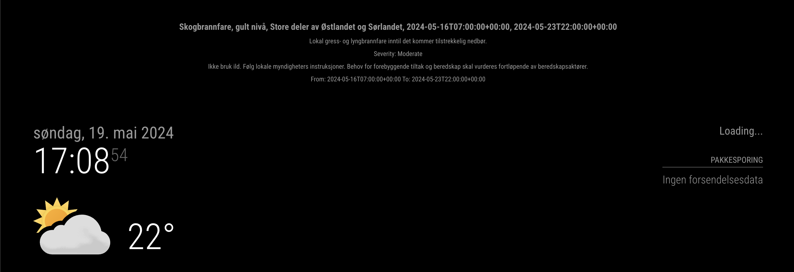

# MMM-ProfileAndWeather
A module for magicmirror that shows profile picture, name and shows weather warnings from metalerts 2.0 (Yr.no)
Set the path to the profilpicture, your latitude/longitude, and your name in your config. Look at configuration options bellow

### Screenshot




### Installation

In your terminal, go to your MagicMirror's Module folder:

```
cd ~/MagicMirror/modules
```

Clone this repository:

```
git clone https://github.com/kurtern84/MMM-ProfileAndWeatherAlerts.git
```

Install repository:

```
cd ~/MagicMirror/modules/MMM-ProfileAndWeatherAlerts/
run npm install
```

Add some [config entries](#configuration) in your config.js file. 

### Configuration

```javascript
{
    module: "MMM-ProfileAndWeatherAlerts",
    position: "top_right",
    config: {
        profileImage: "path/to/profile.jpg",
        name: "John Doe",
        metalertsUrl: "URL_TO_METALERTS_ENDPOINT", // example: https://api.met.no/weatherapi/metalerts/2.0/current?lat=60.67659&lon=10.81997  Change lat and lon. 
        showProfileImage: true,
        showName: true,
        hideWhenNoAlerts: true // Set to true to hide the module when there are no alerts
    }
},

```
Troubleshooting
```
cd ~/MagicMirror/modules/MMM-ProfileAndWeatherAlerts/
npm install request

```

